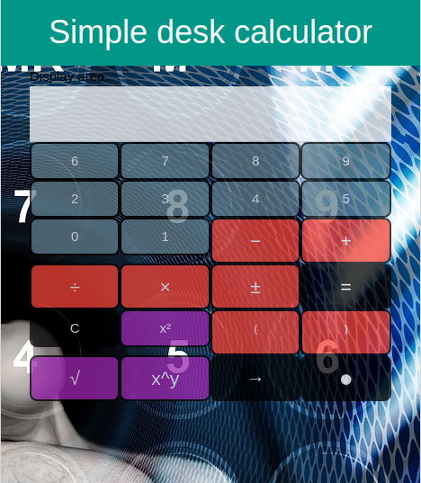

# Simple desk calculator  

This repository contains a simple [desk-calculator](http://christianbender.github.io/desk-calculator).  
The calculator was build with following technologies:  
- HTML5  
- CSS3  
- JavaScript / TypeScript  
- W3.CSS (CSS-Framework)  

---

## Image credits  

Background image of my app:  
- [source](https://pixabay.com/de/gesch%C3%A4ftsmann-zahlen-taschenrechner-2953856/)  
- [author: Gerd Altmann (geralt)](https://pixabay.com/de/users/geralt-9301/)  
- [license: CC0](https://creativecommons.org/publicdomain/zero/1.0/deed.de)  

--- 

## Usage  

The calculator is quite straightforward.  

For using the power-operation: For example 2^3:  
- Click on 2  
- Click on x^y  
- After that click on 3.  
- Finish with click on =  

--- 

## How it looks like  

  